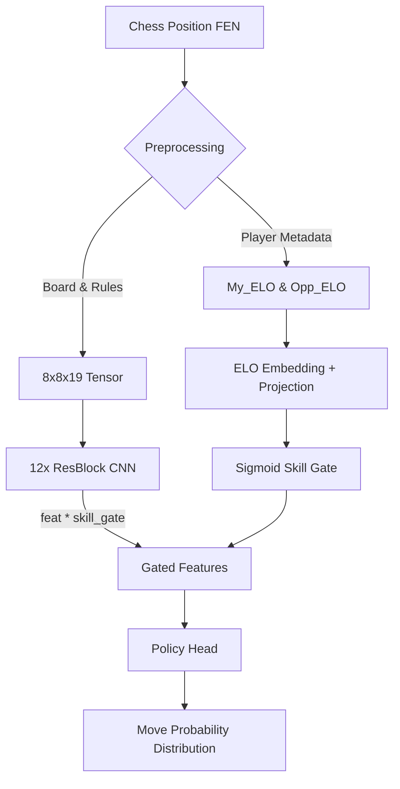

# 🏗️ Architecture & Design

This document details the architectural evolution, input representations, and design decisions behind the human-like chess move prediction models (Legacy vs. Maia-2) developed in this project.

Unlike traditional chess engines (e.g., Stockfish) that search for the objective "best" move, this project aims to predict the move a human player at a specific ELO level would likely make, inspired by Microsoft's Maia Chess.

## 🧠 Model Evolution

The project architecture evolved in two distinct phases to address emerging challenges and incorporate player metadata.

| Feature | Legacy Model (Gen-1) | Maia-2 Model (Gen-2) |
| :--- | :--- | :--- |
| **Core Approach** | Transfer Learning (Fine-Tuning) | Native Training (From Scratch) |
| **Input Shape** | `8x8x14` (Board + Repetition) | `8x8x19` (Board + Rules) |
| **Metadata** | None (Board Only) | Included (`My_ELO`, `Opp_ELO`) |
| **Goal** | General Human Behavior | ELO-Specific & Rule-Aware |

---

## 1. Legacy Architecture (Generation 1)

The initial phase adopted a simplified CNN architecture, standard in early AlphaZero and Leela Chess Zero (Lc0) implementations.

### Input Representation
The model views the chessboard as an 8x8 tensor with 14 channels:

* **Channels 0-5:** White Pieces (Pawn, Knight, Bishop, Rook, Queen, King)
* **Channels 6-11:** Black Pieces (Pawn, Knight, Bishop, Rook, Queen, King)
* **Channel 12:** Repetition Flag (1.0 if position has occurred ≥2 times)
* **Channel 13:** Normalized Move Count (fullmove_number / 100)

### Limitations
This architecture does not explicitly encode "Castling Rights" or "En-passant" possibilities. The model is expected to infer these rules implicitly from the board history or piece positions. This led to performance degradation in tactical positions where castling legality was the deciding factor.

---

## 2. Maia-2 Architecture (Generation 2)

Maia-2 is an advanced architecture designed to fix the rule-blindness of Gen-1 and incorporate player identity.

### Enhanced Input Representation (19 Channels)
Additional channels were introduced to give the model full awareness of the game rules:

* **Channels 0-11:** Piece Positions (White & Black) - *Unchanged*
* **Channel 12:** Repetition Flag (1.0 if ≥2 repetitions) - *Unchanged*
* **Channels 13-16:** Castling Rights (White Kingside, White Queenside, Black Kingside, Black Queenside) - *New*
* **Channel 17:** En Passant Square - *New*
* **Channel 18:** Normalized Move Count (fullmove_number / 200) - *New*

### Metadata Integration (ELO-Awareness via Sigmoid Gating)
The defining feature of Maia-2 is that it looks beyond the board. Two ELO values (`My_ELO`, `Opp_ELO`) are passed through an embedding layer and a linear projection to create a **skill gate**. This gate is applied via element-wise multiplication to the spatial feature maps directly after the Residual Blocks, modulating the representations before they enter the policy head.

This allows the model to differentiate between a **1200 ELO blunder** and a **2500 ELO tactical sacrifice**.

---

## 3. Neural Network Backbone

Both generations utilize Deep Convolutional Neural Networks (CNNs).

* **Backbone:** Residual Network with 12 Residual Blocks (256 filters, 3×3 kernels). Residual connections prevent the "Gradient Vanishing" problem and allow the model to learn long-range spatial dependencies on the board.
* **Batch Size:** `8192` positions (adjustable based on GPU memory).
* **Output:** The model outputs a probability distribution over 4208 possible UCI moves. The move with the highest probability is selected as the predicted human move.

---

## 4. Design Decisions & Rationale

### Motivation for the 19-Channel Design

While analyzing the Legacy model, we observed specific instances of "tactical blindness," particularly in positions where castling legality was ambiguous based solely on the board pieces. The 19-channel architecture was **designed** to address this by explicitly providing castling rights and move history, hypothesizing that this would improve the model's evaluation of "King Safety" without relying on implicit inference.

### Why Isolated Training?

Initially, we relied on Transfer Learning. However, the introduction of ELO metadata in Maia-2 changed the input structure fundamentally, making it difficult to use weights from a standard (non-ELO-aware) base model. Therefore, "Isolated Training" (training from scratch for each ELO bucket) was adopted for the Maia-2 experiments.

### ⚖️ Final Decision: Architecture vs. Resources

A critical realization during this project was the trade-off between **Architectural Superiority** and **Training Depth**.

* **Theory (Maia-2):** The 19-Channel architecture is theoretically superior as it eliminates "blind spots" (e.g., castling rights) and understands player context (`My_ELO`).
* **Practice (Legacy):** However, the 14-Channel model benefits from **Transfer Learning** via a massive "Base Model" pre-trained for 33+ hours.

**Verdict:**
Despite the design advantages of Maia-2, the **14-Channel (Legacy) model was selected for production**. Empirical benchmarks proved that **Transfer Learning (Knowledge Reuse)** currently yields higher accuracy (~52% Top-1 for 2400+) than training a superior architecture from scratch (~44%) under fixed computational constraints.

Maia-2 remains the "Future Direction" of this research, requiring significantly more GPU hours to surpass the Legacy baseline.